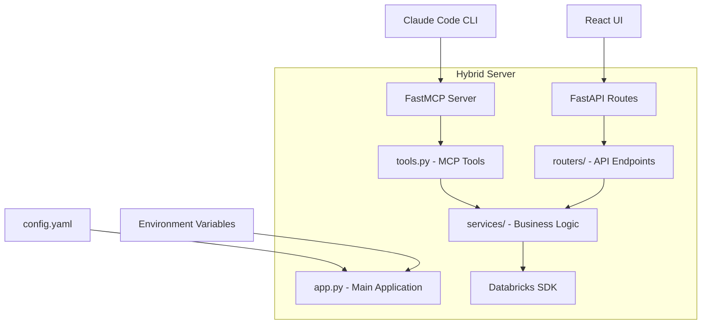

# Databricks MCP Server Architecture Design

## Architecture Overview

The enhanced MCP server follows a **hybrid architecture** that combines FastMCP (for Claude Code CLI integration) with FastAPI (for web UI integration), following patterns from the reference Databricks implementation.



## File Structure & Component Design

### 1. Main Application Layer (`app.py`)

**Purpose**: Entry point that orchestrates FastAPI + FastMCP integration

```python
# app.py - Main application orchestrator
from fastapi import FastAPI
from fastapi.middleware.cors import CORSMiddleware
from fastapi.staticfiles import StaticFiles
from mcp.server.fastmcp import FastMCP
import yaml
from dotenv import load_dotenv

class HybridMCPServer:
    def __init__(self):
        # FastAPI app for web endpoints
        self.fastapi_app = FastAPI(title="Databricks MCP Server")
        
        # FastMCP server for Claude integration  
        self.mcp_server = FastMCP("databricks-mcp-server")
        
        # Load configuration
        self.config = self.load_config()
        
        # Setup middleware and routes
        self.setup_middleware()
        self.setup_routes()
        self.setup_mcp_tools()
    
    def setup_middleware(self):
        """Configure CORS and other middleware"""
        
    def setup_routes(self):
        """Mount API routers"""
        
    def setup_mcp_tools(self):
        """Import and register MCP tools"""
        
    def run(self):
        """Start both servers"""
```

**Key Features**:
- Environment-based configuration loading
- CORS middleware for development
- Static file serving for UI
- Dual protocol support (HTTP + MCP)

### 2. MCP Tools Layer (`tools.py`)

**Purpose**: FastMCP tool definitions with standardized error handling

```python
# tools.py - MCP tool implementations
from mcp.server.fastmcp import FastMCP
from services.databricks_service import DatabricksService
from services.bundle_service import BundleService
from typing import Optional, Dict, Any
import json

# Global service instances
databricks_service = DatabricksService()
bundle_service = BundleService()
mcp = FastMCP("databricks-mcp-server")

@mcp.tool()
async def health() -> str:
    """Check server and Databricks connection health"""
    try:
        health_data = await databricks_service.check_health()
        return create_success_response(health_data)
    except Exception as e:
        return create_error_response(f"Health check failed: {str(e)}")

@mcp.tool()
async def list_jobs(
    limit: int = Field(default=100, description="Maximum number of jobs to return"),
    name_filter: Optional[str] = Field(default=None, description="Filter jobs by name")
) -> str:
    """List all jobs in the Databricks workspace"""
    try:
        jobs = await databricks_service.list_jobs(limit=limit, name_filter=name_filter)
        return create_success_response(jobs)
    except Exception as e:
        return create_error_response(f"Failed to list jobs: {str(e)}")

# Additional tools following same pattern...
```

**Tool Categories**:
1. **Workspace Operations**: `list_jobs`, `get_job`, `run_job`, `list_notebooks`, `export_notebook`
2. **SQL Operations**: `execute_dbsql`, `list_warehouses`  
3. **File Operations**: `list_dbfs_files`, `upload_file`, `download_file`
4. **DAB Generation**: `analyze_notebook`, `generate_bundle`, `validate_bundle`
5. **Health Monitoring**: `health`, `status`, `metrics`

### 3. Service Layer (`services/`)

**Purpose**: Business logic abstraction and reusable components

#### `services/databricks_service.py`
```python
# Databricks API operations
class DatabricksService:
    def __init__(self, config: Dict[str, Any]):
        self.client = WorkspaceClient(
            host=config["databricks"]["host"],
            token=config["databricks"]["token"]
        )
    
    async def check_health(self) -> Dict[str, Any]:
        """Check Databricks connection health"""
        
    async def list_jobs(self, limit: int = 100, name_filter: str = None) -> Dict[str, Any]:
        """List workspace jobs with filtering"""
        
    async def export_notebook(self, path: str, format: str = "SOURCE") -> Dict[str, Any]:
        """Export notebook content"""
        
    async def execute_sql(self, query: str, warehouse_id: str = None) -> Dict[str, Any]:
        """Execute SQL query on warehouse"""
```

#### `services/bundle_service.py`  
```python
# DAB generation and validation
class BundleService:
    def __init__(self, config: Dict[str, Any]):
        self.config = config
        
    async def analyze_notebook(self, path: str) -> Dict[str, Any]:
        """Analyze notebook structure and dependencies"""
        
    async def generate_bundle(
        self, 
        name: str, 
        notebooks: List[str], 
        jobs: List[int] = None
    ) -> Dict[str, Any]:
        """Generate DAB configuration from analysis"""
        
    async def validate_bundle(self, bundle_config: str) -> Dict[str, Any]:
        """Validate generated bundle configuration"""
```

#### `services/analysis_service.py`
```python
# Code analysis and recommendations
class AnalysisService:
    async def parse_dependencies(self, notebook_content: str) -> Dict[str, Any]:
        """Extract imports and dependencies"""
        
    async def identify_data_sources(self, notebook_content: str) -> Dict[str, Any]:
        """Find data source patterns"""
        
    async def generate_recommendations(self, analysis: Dict[str, Any]) -> Dict[str, Any]:
        """Create optimization recommendations"""
```

### 4. FastAPI Routing Layer (`routers/`)

**Purpose**: HTTP endpoints for UI integration and external APIs

#### `routers/health.py`
```python
# Health check endpoints
from fastapi import APIRouter, Depends
from services.databricks_service import DatabricksService

router = APIRouter(prefix="/health", tags=["health"])

@router.get("/")
async def health_check(service: DatabricksService = Depends()):
    """Basic health endpoint"""
    return await service.check_health()

@router.get("/detailed")  
async def detailed_health(service: DatabricksService = Depends()):
    """Comprehensive health with Databricks connection test"""
```

#### `routers/mcp_info.py`
```python
# MCP server information
router = APIRouter(prefix="/mcp", tags=["mcp"])

@router.get("/tools")
async def list_mcp_tools():
    """List available MCP tools"""
    
@router.get("/status")
async def mcp_server_status():
    """MCP server operational status"""
```

#### `routers/chat.py`
```python
# Chat integration endpoints
router = APIRouter(prefix="/chat", tags=["chat"])

@router.post("/message")
async def send_chat_message(message: ChatMessage):
    """Send message to Claude via MCP tools"""
    
@router.websocket("/ws")
async def websocket_chat(websocket: WebSocket):
    """WebSocket for real-time chat"""
```

### 5. Configuration System (`config.yaml`)

**Purpose**: Centralized, environment-aware configuration

```yaml
# config.yaml - Main configuration
server:
  name: "databricks-mcp-server"
  version: "0.2.0"
  fastapi:
    host: "${SERVER_HOST:localhost}"
    port: ${SERVER_PORT:8000}
    debug: ${DEBUG:false}
  mcp:
    host: "${MCP_HOST:localhost}" 
    port: ${MCP_PORT:5173}

databricks:
  host: "${DATABRICKS_HOST}"
  token: "${DATABRICKS_TOKEN}"
  warehouse_id: "${DATABRICKS_WAREHOUSE_ID}"
  timeout: ${DATABRICKS_TIMEOUT:30}

logging:
  level: "${LOG_LEVEL:INFO}"
  format: "%(asctime)s - %(name)s - %(levelname)s - %(message)s"
  file: "${LOG_FILE:mcp_server.log}"

cors:
  enabled: ${CORS_ENABLED:true}
  origins:
    - "http://localhost:3000"  # React dev server
    - "http://localhost:5173"  # Vite dev server
    - "https://*.databricks.com"  # Databricks domains

tools:
  enabled:
    # Core tools
    - health
    - list_jobs
    - get_job
    - run_job
    - list_notebooks
    - export_notebook
    
    # Extended tools  
    - execute_dbsql
    - list_warehouses
    - list_dbfs_files
    
    # DAB tools
    - analyze_notebook
    - generate_bundle
    - validate_bundle
    - create_tests
    
  rate_limits:
    default: "100/minute"
    export_notebook: "10/minute"
    execute_dbsql: "50/minute"

cache:
  enabled: ${CACHE_ENABLED:true}
  ttl:
    jobs: 300      # 5 minutes
    notebooks: 180  # 3 minutes
    warehouses: 600 # 10 minutes
```

### 6. Response Standards & Error Handling

**Purpose**: Consistent response format and comprehensive error handling

```python
# models/responses.py
from pydantic import BaseModel
from typing import Optional, Any
from datetime import datetime
from enum import Enum

class ResponseStatus(str, Enum):
    SUCCESS = "success"
    ERROR = "error"
    PARTIAL = "partial"

class MCPResponse(BaseModel):
    status: ResponseStatus
    data: Optional[Any] = None
    error: Optional[str] = None
    warnings: Optional[List[str]] = None
    timestamp: datetime
    request_id: Optional[str] = None

class ErrorDetail(BaseModel):
    code: str
    message: str
    context: Optional[Dict[str, Any]] = None

# Error handling utilities
def create_success_response(data: Any, warnings: List[str] = None) -> str:
    """Create standardized success response"""
    
def create_error_response(
    error: str, 
    error_code: str = "GENERAL_ERROR",
    context: Dict[str, Any] = None
) -> str:
    """Create standardized error response"""
    
def handle_databricks_error(error: Exception) -> str:
    """Handle Databricks SDK specific errors"""
```

## Component Interactions & Data Flow

### 1. MCP Tool Execution Flow
```
Claude CLI → FastMCP → Tool Handler → Service Layer → Databricks SDK → Response
```

### 2. Web UI Interaction Flow  
```
React UI → FastAPI Router → Service Layer → Databricks SDK → JSON Response
```

### 3. DAB Generation Workflow
```
1. list_notebooks() → Get available notebooks
2. export_notebook() → Get notebook content  
3. analyze_notebook() → Parse dependencies
4. generate_bundle() → Create DAB config
5. validate_bundle() → Check configuration
6. create_tests() → Generate test scaffolds
```

## Deployment Architecture

### Local Development
```yaml
# docker-compose.yml
version: '3.8'
services:
  mcp-server:
    build: ./mcp/server
    ports:
      - "8000:8000"  # FastAPI
      - "5173:5173"  # FastMCP
    environment:
      - DEBUG=true
      - CORS_ENABLED=true
    volumes:
      - ./mcp/server:/app
    command: python app.py
```

### Databricks App Deployment
```python
# databricks_app.py - Production entry point
class ProductionServer:
    def __init__(self):
        # Single server supporting both protocols
        # Security-hardened configuration
        # Unity Catalog integration
        # OAuth authentication
```

## Testing Strategy

### Unit Tests Structure
```
tests/
├── test_tools.py           # MCP tool testing
├── test_services.py        # Service layer testing  
├── test_routers.py         # FastAPI endpoint testing
├── test_config.py          # Configuration testing
├── fixtures/               # Test data
└── integration/            # End-to-end tests
    ├── test_cli_workflow.py
    ├── test_ui_workflow.py
    └── test_dab_generation.py
```

## Security Considerations

### Authentication & Authorization
- **OAuth integration** for Databricks workspace access
- **API key validation** for external access
- **Permission inheritance** from Unity Catalog
- **Rate limiting** per user/tool

### Data Security
- **No credential logging** in any component
- **Secure secret management** via environment variables
- **Input validation** for all tool parameters
- **SQL injection prevention** for database queries

## Performance Optimization

### Caching Strategy
- **In-memory caching** for frequently accessed data
- **TTL-based expiration** for workspace resources
- **Cache invalidation** on workspace changes

### Connection Pooling
- **Databricks SDK connection reuse**
- **Async request handling** for concurrent operations
- **Request queuing** for rate limit management

This architecture provides a robust foundation for the Databricks MCP server that can scale from local development to production deployment while maintaining clean separation of concerns and following established patterns.